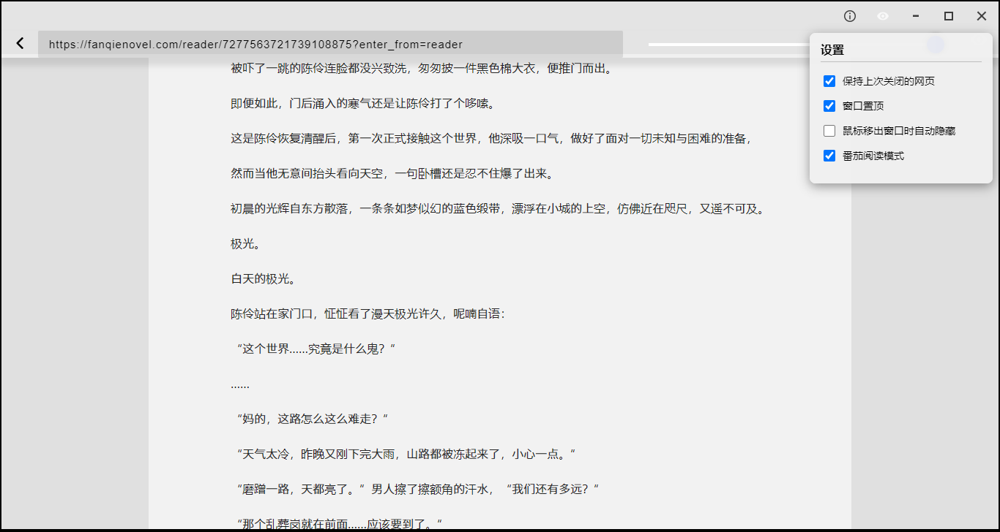
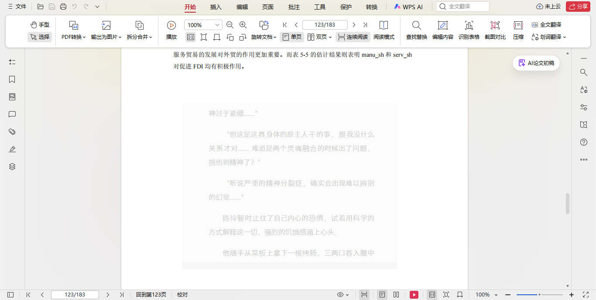

# **ZenView**

> 此项目基于 [glass-browser](https://github.com/mitchas/glass-browser) 修改而来，**基础代码**遵循 **CC0 1.0** 协议（详见 `LICENSE.original`）。  
> **新增及修改代码**（含 AI 辅助生成部分）遵循 **GPL v3** 协议（详见 `LICENSE`）。  
> 📢 **特别声明**：本软件初衷是为打工牛马摸鱼减负，拒绝成为资本镰刀的磨刀石——**禁止任何以盈利为目的的商业闭源使用** 😎。

**一个适用于 Windows 的摸鱼浏览器。**
  - 一键开启无边框沉浸模式
  - 随心调节窗口透明度
  - 任意调节窗口大小
  - 窗口置顶
  - 鼠标移出浏览器窗口自动隐藏
  - 无任务栏便签
  - 快速隐藏快捷键：双击鼠标中键+全局显隐快捷键：双击 Backquote 键
  - 记录上次打开网页
  - 番茄小说专属阅读优化

## 本地构建和运行：
- 克隆仓库。
- 进入目录
- 确保安装了 electron `npm install electron`
- 安装并运行 `npm install && npm start`

## 打包（.app for mac, .exe for windows, 或 linux ** 在 Mac 和 Linux 上未经测试）
- 安装 [Electron Packager Interactive](https://github.com/Urucas/electron-packager-interactive)：`npm install -g electron-packager-interactive`
- 运行 `epi`
- 按照步骤操作
  - 图标路径为 `./assets/icon.ico'

## 使用方法
- 输入 URL 并按 Enter
- 调整窗口大小并定位到您想要的位置。
- 根据您的喜好调整透明度。
- 点击眼睛图标（透明度滑块旁）启用沉浸阅读模式（隐藏浏览器边框）。
- 点击最小化旁眼睛图标可看到设置菜单。
- 双击Backquote 键触发隐藏。

## 缓存位置
浏览器保存的记录和设置缓存位置：
- 存储方式：使用 localStorage（HTML5 本地存储）
- 存储位置：%APPDATA%\ZenView\Local Storage\leveldb

## 碎碎念
哈哈哈哈哈，真服了，不咋会用GitHub，做完忘了改成公开仓库了，整个项目基本上都是TRAE SOLO写的，好厉害，挺早之前就想做一个这样的浏览器，可惜豆包太笨了，气的肝疼就搁置了，现在终于时做出一个勉强能用的版本，但还是有好些bug，下次有缘或者等我实在受不了再让AI帮我想想办法，最后还是感谢原作者提供的模板🙏
